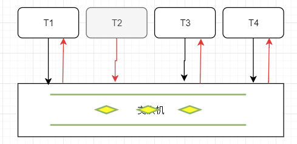
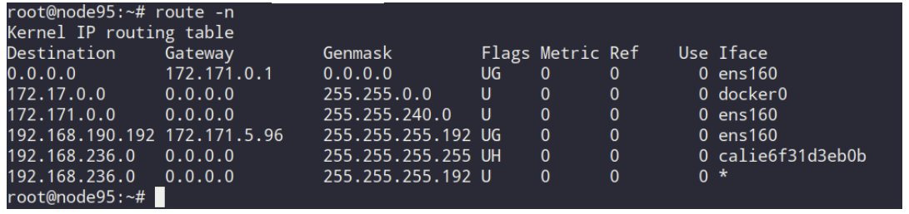

# OSI七层网络模型

OSI是一种开放系统互连参考模型 (Open System Interconnect 简称OSI），是国际标准化组织(ISO)和国际电报电话咨询委员会(CCITT)联合制定的开放系统互连参考模型，为开放式互连信息系统提供了一种功能结构的框架。

* 物理层：物理层主要是用来处理光电信号的，例如网卡，光纤，网线等等，这些都是物理层需要考虑的地方；

* 链路层：由光电信号组成的数据，在数据链路层，被逻辑地划分成一帧一帧地数据以便管理，这一层是数据交换的主要层面，交换的依据是网卡MAC地址，进行数据交换需要定义信号帧格式，就有了以太网，需要在主机间交换数据，就有了交换机和集线器；因此以太网，交换机以及集线器都是这一层要考虑的；

* 网络层：网络层是比数据链路层更高一级的逻辑层，在这一层工作的主要是路由器，路由器是基于IP地址进行跨网链路的计算；

* 传输层：传输层是用来控制网络层的数据传输的，提供了TCP和UDP两种机制来确保数据网络间传输的可靠性，这样写代码的就只需要打开socket套接字，便可以在网络连接的状态下传输数据；

* 表示层：

* 会话层：

* 应用层：应用层是最高协议层，这一层主要是软件自定义的一些协议，如HTTP协议，websocket协议，远层登录SSH协议等;

## 物理层

### 物理层定义

物理层为设备之间的数据通信提供传输媒体及互连设备，为数据传输提供可靠的环境。

物理层的媒体包括架空明线、平衡电缆、光纤、无线信道等。

通信用的互连设备指DTE和DCE间的互连设备。

* DTE即数据终端设备，又称物理设备，如计算机、终端等都包括在内。
* DCE则是数据通信设备或电路连接设备，如调制解调器等。

数据传输通常是经过DTE——DCE，再经过DCE——DTE的路径。

互连设备指将DTE、DCE连接起来的装置，如各种插头、插座。LAN中的各种粗、细同轴电缆、T型接、插头，接收器，发送器，中继器等都属物理层的媒体和连接器。

## 数据链路层

### 链路层定义

数据链路可以粗略地理解为数据通道。

物理层要为终端设备间的数据通信提供传输媒体及其连接.媒体是长期的,连接是有生存期的.

在连接生存期内,收发两端可以进行不等的一次或多次数据通信.每次通信都要经过建立通信联络和拆除通信联络两过程.这种建立起来的数据收发关系就叫作数据链路.

而在物理媒体上传输的数据难免受到各种不可靠因素的影响而产生差错,为了弥补物理层上的不足,为上层提供无差错的数据传输,就要能对数据进行检错和纠错.

### 数据链路层的基本任务

* 数据链路的建立，拆除，分离
* 帧定界和帧同步
* 顺序控制
* 差错检测和恢复
* 链路标识
* 流量控制

### 数据链路层产品

网卡、网桥

## 网络层

### 网络层定义

当数据终端增多时。它们之间有中继设备相连。

此时会出现一台终端要求不只是与唯一的一台而是能和多台终端通信的情况,这就是产生了把任意两台数据终端设备的数据链接起来的问题,也就是**路由**或者叫寻径。

另外,当一条物理信道建立之后,被一对用户使用,往往有许多空闲时间被浪费掉.人们自然会希望让多对用户共用一条链路，为解决这一问题就出现了逻辑信道技术和虚拟电路技术。

### 网络层的主要功能

网络层为建立网络连接和为上层提供服务,应具备以下主要功能：

* 路由选择和中继
* 激活,终止网络连接
* 在一条数据链路上复用多条网络连接,多采取分时复用技术
* 差错检测与恢复
* 排序,流量控制
* 服务选择
* 网络管理

## 传输层

### 定义

传输层是两台计算机经过网络进行数据通信时,第一个端到端的层次，具有缓冲作用。当网络层服务质量不能满足要求时，它将服务加以提高，以满足高层的要求；当网络层服务质量较好时，它只用很少的工作。传输层还可进行复用，即在一个网络连接上创建多个逻辑连接。 

## 会话层

### 定义

会话层提供的服务可使应用建立和维持会话，并能使会话获得同步。

会话层使用校验点可使通信会话在通信失效时从校验点继续恢复通信。这种能力对于传送大的文件极为重要。

## 表示层

### 定义

会话层以下5层完成了端到端的数据传送,并且是可靠,无差错的传送.但是数据传送只是手段而不是目的,最终是要实现对数据的使用.各种系统对数据的定义并不完全相同,

表示层是为异种机通信提供一种公共语言，以便能进行互操作。这种类型的服务之所以需要，是因为不同的计算机体系结构使用的数据表示法不同。例如，IBM主机使用EBCDIC编码，而大部分PC机使用的是ASCII码。在这种情况下，便需要会话层来完成这种转换。

## 应用层

应用层向应用程序提供服务，这些服务按其向应用程序提供的特性分成组，并称为服务元素。有些可为多种应用程序共同使用，有些则为较少的一类应用程序使用。

# OSI七层网络模型协议堆栈

# overlay网络（覆盖网络）

Overlay 在网络技术领域，指的是一种网络架构上叠加的虚拟化技术模式，其大体框架是对基础网络不进行大规模修改的条件下，实现应用在网络上的承载，并能与其它网络业务分离，并且以基于IP的基础网络技术为主。Overlay 技术是在现有的物理网络之上构建一个虚拟网络，上层应用只与虚拟网络相关。

覆盖网络就是应用层网络，它是面向应用层的，不考虑或很少考虑网络层，物理层的问题。

详细说来，覆盖网络是指建立在另一个网络上的网络。该网络中的结点可以看作通过虚拟或逻辑链路而连接起来的。虽然在底层有很多条物理链路，但是这些虚拟或逻辑链路都与路径一一对应。例如：许多P2P网络就是覆盖网络，因为它运行在互连网的上层。覆盖网络允许对没有IP地址标识的目的主机路由信息，例如：Freenet 和DHT（分布式哈希表）可以路由信息到一个存储特定文件的结点，而这个结点的IP地址事先并不知道。

覆盖网络被认为是一条用来改善互连网路由的途径，让二层网络在三层网络中传递，既解决了二层的缺点，又解决了三层的不灵活！

 **VXLAN**（Virtual eXtensible LAN）技术是当前最为主流的Overlay标准。**Flannel**中也有基于VXLAN的Overlay 网络（其他的UDP、AWS VPC和GCE）

# 二层网络和三层网络

七层网络中，物理层，数据链路层和网络层是低三层网络，其余四层是高三层网络。

**二层网络**指的就是数据链路层，**三层网络**指的就是网络层，这两者使我们需要重点理解的地方。

在数据链路层，物理信号以帧为单位进行组织，而每帧信号都需要一个目标地址和一个源地址，该地址基本上使用的是网卡MAC地址，在一层工作的主要是集线器和交换机，集线器会将所有帧信号投放到各个端口，因此连接端口的主机会收到很多没有意义的数据帧，这将造成集线器和主机之间信道冲突剧烈，因此集线器一般情况下使用较少，而交换机具有MAC地址学习记忆功能，能够准确的将数据帧投放到指定端口，从而大大地提高了数据传输效率；而在L2层，数据只能在一个子网间进行交换，如果要跨子网传输数据，则需要借助L3层的路径规划功能，也就是路由器的工作原理；

假设现有如下网络拓扑图，ABCD四台主机属于10.0.0.0子网，网关指向路由器1的10.0.0.1，EFGH四台主机属于10.0.1.0子网，网关指向路由器2的10.0.1.1；

## 同一子网通信

先看同一子网内通信情况，A向C发送数据，这种情况下都是ip指定的，假设所有主机，交换机和路由器都刚刚通电，没缓存任何MAC映射和路由表。A在向C发送数据之前，是知道C的ip地址，发现它俩在同一物理子网，于是A试图在物理子网内来寻找C,但是在物理子网内寻址是通过MAC地址的，A并不知道C的MAC地址，于是A发送了一个ARP广播包，ARP广播用的地址是ff:ff:ff:ff:ff:ff,包内容如下：

| 源MAC             | 目标MAC           | 源IP     | 目标IP   |
| ----------------- | ----------------- | -------- | -------- |
| xx:xx:xx:xx:xx:aa | ff:ff:ff:ff:ff:ff | 10.0.0.2 | 10.0.0.4 |

交换机收到ARP广播后，首先会学习到主机A是连接到1端口的，然后缓存起来，同时在缓存中查找C的MAC地址，没找到便将这个广播包从所有端口发出去(1端口除外)，交换机2收到广播包后，也会在缓存中查找C的MAC地址，没找到同样进行转发，其中B，D主机收到广播包后发现和自己无关便丢弃，而C收到广播后便会进行回应，来告知自己的身份，内容格式如下：

| 源MAC             | 目标MAC           | 源IP     | 目标IP   |
| ----------------- | ----------------- | -------- | -------- |
| xx:xx:xx:xx:xx:ac | xx:xx:xx:xx:xx:aa | 10.0.0.4 | 10.0.0.2 |

这个对于参与的交换机也是个学习的过程，在过程中记忆了主机A和主机C的ip地址和mac地址，AC找到彼此后，便可以在同一子网内依靠mac地址进行相互通信，格式如下：

|       | 源MAC             | 目标MAC           | 源IP     | 目标IP   |
| ----- | ----------------- | ----------------- | -------- | -------- |
| C-->A | xx:xx:xx:xx:xx:ac | xx:xx:xx:xx:xx:aa | 10.0.0.4 | 10.0.0.2 |
| A-->C | xx:xx:xx:xx:xx:aa | xx:xx:xx:xx:xx:ac | 10.0.0.2 | 10.0.0.4 |

## 跨物理子网通信

同样假设所有设备都刚刚通电，没有缓存任何信息，这时A向E发送数据，A是知道E的ip地址，发现属于同一网段，同样不知道E的mac地址，于是A同样发送ARP广播包,BCD没有响应，但是路由器1收到广播后，为了避免广播风暴，会把自己的mac地址告诉A，格式如下：

| 源MAC             | 目标MAC           | 源IP     | 目标IP   |
| ----------------- | ----------------- | -------- | -------- |
| xx:xx:xx:xx:xx:ca | xx:xx:xx:xx:xx:aa | 10.0.0.1 | 10.0.0.2 |

A等待超时后，会知道E不在当前物理子网内，于是会向路由器1发送数据包，路由器收到数据包后，发现没有缓存E的ip地址，于是路由器1开始寻找E的过程。相比较交换机的广播找人，路由器寻址的空间范围更大，很多情况下是整个internet网络，要跨很多网络运营商，因此L3层面路由器的路径寻址计算协议涉及很多，例如：RIP、OSPF、IS-IS、BGP、IGRP等协议。路由器计算路径时，是无法窥探整个互联网的，因此每台路由器都是通过路由算法找到下一跳的最优路径，这些最优路径汇集起来就是完整的寻址路径，换句话说，路由器的转发路径不是一台路由器选出来的，而是很多路由器共同选择出来的最优下一跳地址序列；在这里为了解释原理，假设路由器1直接找到了路由器2。

这样路由器1开始想路由器2发送数据包，路由器2便开始在自己的物理子网内寻找E,进过一次广播后，发现E在自己子网内，于是向前一跳，找到离自己最近的路由器1，反馈自己离E主机最近，最终经过“A->广播->路由器->路由器寻址->找到E主机所在子网”过程的A,便可以和E进行通信了。由于A和E之间经历了多个物理子网，因此需要经历多次L2的转发才能实现数据包的转达，在这个过程中，ip包外包的数据帧中的mac地址是不断变换的。在A-E-A的过程中，数据帧和IP包的地址经历了如下过程(假设A的通信端口是88，而E的是99)：
 去包：

|                | 源MAC             | 目标MAC           | 源IP     | 目标IP   | 源端口 | 目的端口 | 用户数据 | 帧尾  |
| -------------- | ----------------- | ----------------- | -------- | -------- | ------ | -------- | -------- | ----- |
| A--->路由1     | xx:xx:xx:xx:xx:aa | xx:xx:xx:xx:xx:ca | 10.0.0.2 | 10.0.0.6 | 88     | 99       | .....    | ....  |
| 路由1--->路由2 | xx:xx:xx:xx:xx:cb | xx:xx:xx:xx:xx:cc | 10.0.0.2 | 10.0.0.6 | 88     | 99       | ...      | ..... |
| 路由2--->E     | xx:xx:xx:xx:xx:cd | xx:xx:xx:xx:xx:ae | 10.0.0.2 | 10.0.0.6 | 88     | 99       | ...      | ..... |

回包：

|                | 源MAC             | 目标MAC           | 源IP     | 目标IP   | 源端口 | 目的端口 | 用户数据 | 帧尾  |
| -------------- | ----------------- | ----------------- | -------- | -------- | ------ | -------- | -------- | ----- |
| E--->路由2     | xx:xx:xx:xx:xx:ae | xx:xx:xx:xx:xx:cd | 10.0.0.6 | 10.0.0.2 | 99     | 88       | ...      | ..... |
| 路由2--->路由1 | xx:xx:xx:xx:xx:cc | xx:xx:xx:xx:xx:cb | 10.0.0.6 | 10.0.0.2 | 99     | 88       | ...      | ..... |
| 路由1--->A     | xx:xx:xx:xx:xx:ca | xx:xx:xx:xx:xx:aa | 10.0.0.6 | 10.0.0.2 | 99     | 88       | .....    | ....  |

数据包在路由1和2中的1，4端口中进行转发时，因为是在设备内部，因此可以直接转发，不用变换帧头，从而提高效率，另外如果A向其他子网的FGH发送数据时，过程基本上一样，只不过不会通过广播寻址，而是直接将数据包发送给路由器出口网关。

# LAN

LAN，全称Local Area Network，中文名叫做**局域网**。

顾名思义，LAN是指在某一区域内由多台计算机互联成的计算机组。一般是方圆几千米以内。局域网可以实现文件管理、应用软件共享、打印机共享、工作组内的日程安排、电子邮件和传真通信服务等功能。局域网是封闭型的，可以由办公室内的两台计算机组成，也可以由一个公司内的上千台计算机组成。

# VLAN

## 什么是VLAN

Virtual Local Area Network意为虚拟局域网，是在交换机实现过程中涉及到的概念，由802.1Q标准所定义。

交换机工作在链路层，连接在同一台交换机的终端处于同一个三层网络中，同时也处于同一个广播域。

当交换机接入较多的终端时，任意一台终端发送广播报文时(例如：ARP请求)，报文都会传遍整个网络，会导致报文消息泛滥，甚至网络风暴。下图为T2终端发出的ARP请求。

## VLAN的优点

对于规模较大的组网场景，广播报文的泛滥对于网络通信将会造成较大的影响。

VLAN技术为这一问题提供了解决方案，VLAN将同一网络划分为多个逻辑上的虚拟子网，并规定当收到广播报文时，仅仅在其所在VLAN中进行广播从而防止广播报文泛滥。VLAN技术在**链路层的层次**中实现了广播域的隔离，一张图看懂VLAN作用：

802.1Q标准基于传统以太网帧的格式添加了描述VLAN信息的字段

其中增加的VID是VLAN 的唯一标识共12位，意味一个以太网最多可以划分为4094个VLAN。

虽然有这些优点，然而它的弊端也很明显：

- VLAN个数限制为4094，云环境中虚拟设备增多，应用增加。

  虚拟化技术的发展促使大数据、云计算技术公司采用单个物理设备虚拟多台虚拟机的方式来进行组网，因此对于支持VLAN的数量要求也在提升，加上VLAN技术最多支持4094个VLAN，因此已经无法满足需求。

- 多租户情况下的IP地址、MAC地址重叠。

  公有云提供商的业务要求将实体网络租借给多个不同的用户，这些用户对于网络的要求有所不同，而不同用户租借的网络有很大的可能会出现IP地址、MAC地址的重叠，传统的VLAN仅仅解决了同一链路层网络广播域隔离的问题，而并没有涉及到网络地址重叠的问题，因此需要一种新的技术来保证在多个租户网络中存在地址重叠的情况下依旧能有效通信的技术。

- 所有终端连接到二层交换机，增加交换机负担。

  虚拟化技术的出现增加了交换机的负担，对于大型的数据中心而言，单台交换机必须支持数十台以上主机的通信连接才足以满足应用需求，而虚拟化技术使得单台主机可以虚拟化出多台虚拟机同时运行，而每台虚拟机都会有其唯一的MAC地址。这样，为了保证集群中所有虚机可以正常通信，交换机必须保存每台虚机的MAC地址，这样就导致了交换机中的MAC表异常庞大，从而影响交换机的转发性能。

基于以上需求，VXLAN技术被提出。

# VXLAN

## 隧道技术

隧道技术是一种通过使用互联网络的基础设施在网络之间传递数据的方式。使用隧道传递的数据（或负载）可以是不同协议的[数据帧](https://baike.baidu.com/item/数据帧/10571824)或包。隧道协议将其它协议的[数据帧](https://baike.baidu.com/item/数据帧/10571824)或包重新封装然后通过隧道发送。新的帧头提供路由信息，以便通过互联网传递被[封装](https://baike.baidu.com/item/封装/2796965)的负载数据。
隧道技术是一种端到端的协议，该协议将原有的数据包重新封装，通过隧道发到对端。

## VXLAN概念

Local Area Network，虚拟扩展局域网。VXLAN是一种隧道技术。

VXLAN通过将虚拟网络中的数据帧封装在实际物理网络中的报文中进行传输。具体实现方式为：将虚拟网络的数据帧添加VXLAN首部后，封装在物理网络中的UDP报文中，然后以传统网络的通信方式传送该UDP报文，到达目的主机后，去掉物理网络报文的头部信息以及VXLAN首部，将报文交付给目的终端。整个通信过程目的终端不会感知到物理网络的存在。所以VXLAN也承担着封包和解包的过程。

### VXLAN报文格式

位于不同网络中的终端，通过VXLAN使终端所在的路由器之间形成一条在虚拟链路中的通道，称之为vxlan隧道终端VTEP(VXLAN Tunnel End Point)。如果终端是物理机，那么充当VTEP一般是交换机、路由器等硬件，但是如果是物理机上的虚拟终端一般是由所在物理机的的hypervisor进程承担VTEP的功能。

VXLAN传输过程中，将逻辑链路网络的数据帧添加VXLAN首部后，依次添加UDP首部，IP首部，以太网帧首部后（见VXLAN报文格式），在物理网络中传输。其中的IP中的源地址和目标地址指的是VTEP地址。
VTEP的转发表格式

其中VNI表示的是租户，MAC便是终端的地址，VTEP表示终端坐在的VXLAN。通过这个转发表就可以控制租户与租户之间的隔离

IETF定义NVO3标准技术之一，采用MAC-in-UDP报文封装模式，通过将二层报文使用三层协议封装实现二层网络在三层范围内扩展，满足数据中心大二层虚拟机迁移和多租户需求;VXLAN技术可以基于三层网络结构来构建二层虚拟网络，通过VLAN技术可以将处于不同网段网络设备整合在同一个逻辑链路层网络中，对于终端用户而言，这些网络设备似乎“真实地”部署在了同一个链路层网络中。

也就是说，它可以通过将第2层扩展到第3层网络来构建大型的多租户数据中心，同时将虚拟网络与物理基础设施分离，并实现网络可靠性和可扩展性。因此，您可以使用VXLAN技术创建多达1600万个网络。

### VXLAN术语

- NVE：NetworkVirtualization Edge，网络虚拟边缘，用于建立VxLAN隧道的网络设备;
- VTEP：VxLANtunnel End Point，VxLAN隧道端点，指建立VxLAN隧道的NVE设备端点IP，可用于静态VxLAN配置及动态VxLAN配置;
- VNI：VirtualNetwork Identifier，虚拟网络ID，一个VNI即一个VxLAN广播域，实现VxLAN广播域隔离，相当于VLAN中的VLAN ID;
- BD:BridgeDomain，定义一个VxLAN广播域，可配合配置BDIF，实现跨VxLAN路由，一个BD唯一映射一个VNI;

### VXLAN网络中的终端和非VXLAN网络中的节点进行通信

由于VXLAN网络中的终端使用的都是虚拟网络地址，而非VXLAN中的设备使用的是实际的物理地址，此时，VXLAN网关将起到地址转换的作用，通信时，临时将VXLAN终端的虚拟地址转换为物理地址，然后再与外网进行通信。地址转换的方式可基于NAT机制

## VXLAN的优势与局限

相比VLAN技术，VXLAN技术具有以下的优势：

* 有24位表示VNI，可以支持更多的网络虚拟设备

  24位长度的VNI字段值可以支持更多数量的虚拟网络，解决了VLAN数目上限为4094的局限性的问题。

* 采用隧道技术，使得三层网络无感知

  VXLAN技术通过隧道技术在物理的三层网络中虚拟二层网络，处于VXLAN网络的终端无法察觉到VXLAN的通信过程，这样也就使得逻辑网络拓扑和物理网络拓扑实现了一定程度的解耦，网络拓扑的配置对于物理设备的配置的依赖程度有所降低，配置更灵活更方便。

* 多租户情况下，各租户可以独立组网，通信，地址分配

  VLAN技术仅仅解决了二层网络广播域分割的问题，而VXLAN技术还具有多租户支持的特性，通过VXLAN分割，各个租户可以独立组网、通信，地址分配方面和多个租户之间地址冲突的问题也得到了解决。

局限：

* 要求物理网络链路层提供足够大的MTU值

  为了保证VXLAN机制通信过程的正确性，rfc7348标准中规定，涉及到VXLAN通信的IP报文一律不允许分片，这就要求物理网络的链路层实现中必须提供足够大的MTU值，保证VXLAN报文的顺利传输，这一点可以理解为当前VXLAN技术的局限性。

## VXLAN的应用场景

VXLAN在云数据中心之间虚拟机迁移中的应用，如某个企业在不同的数据中心有不同业务应用的虚拟机，数据中心之间虚拟机迁移是经常会遇到的，为了保证虚拟机迁移过程中业务不中断，则需要保证迁移虚拟机的IP地址、MAC地址等参数保持不变，这就要求虚拟机迁移前后属于统一个二层网络。如果使用传统方法解决此问题，可能需要购买新的物理设备以分离流量，并可能导致诸如VLAN散乱、网络成环以及系统和管理开销等问题。

为了成功实现虚拟机在业务不中断情况下的迁移，可通过VXLAN技术实现。VXLAN是MAC in UDP的网络虚拟化技术，只要物理网络支持IP转发，所有IP路由可达的终端用户即可建立一个大范围二层网络;在虚拟机上联的交换机上配置VXLAN相关信息，虚拟机上联交换机之间建立VXLAN隧道和VXLAN网关，通过VXLAN隧道和VXLAN网关，可实现在不同数据中心之间虚拟机成功迁移，并且可保证虚拟机迁移过程中网络无感知、业务不中断。

VXLAN在SDN环境下的应用，SDN环境下，可以通过SDN控制器来实现VXLAN的IP和VID之间相关信息的对应关系，SDN控制器可以作为ARP代答设备，这样大大提高了VXLAN的灵活性与扩展性。所以VXLAN技术在SDN环境中可以被广泛应用。

# Flannel

Flannel实质上是一种“覆盖网络(overlay network)”，也就是将TCP数据包装在另一种网络包里面进行路由转发和通信，目前已经支持UDP、VxLAN、AWS VPC和GCE路由等数据转发方式。

默认的节点间数据通信方式是UDP转发。

## 工作原理

数据从源容器中发出后，经由所在主机的docker0虚拟网卡转发到flanneld虚拟网卡，这是个P2P的虚拟网卡，flanneld服务监听在网卡的另外一端。

Flannel通过Etcd服务维护了一张节点间的路由表，详细记录了各节点子网网段 。

源主机的flanneld服务将原本的数据内容UDP封装后根据自己的路由表投递给目的节点的flanneld服务，数据到达以后被解包，然后直接进入目的节点的flannel0虚拟网卡，然后被转发到目的主机的docker0虚拟网卡，最后就像本机容器通信一下的有docker0路由到达目标容器。

# CNI--容器网络接口

不管是 docker 还是 kubernetes，在网络方面目前都没有一个完美的、终极的、普适性的解决方案，不同的用户和企业因为各种原因会使用不同的网络方案。目前存在网络方案 flannel、calico、openvswitch、weave、ipvlan等，而且以后一定会有其他的网络方案，这些方案接口和使用方法都不相同，而不同的容器平台都需要网络功能，它们之间的适配如果没有统一的标准，会有很大的工作量和重复劳动。

CNI 就是这样一个标准，它旨在为容器平台提供网络的标准化。不同的容器平台（比如目前的 kubernetes、mesos 和 rkt）能够通过相同的接口调用不同的网络组件。

CNI(Conteinre Network Interface) 是 google 和 CoreOS 主导制定的容器网络标准，它 本身并不是实现或者代码，可以理解成一个协议。这个标准是在 [rkt 网络提议](https://docs.google.com/a/coreos.com/document/d/1PUeV68q9muEmkHmRuW10HQ6cHgd4819_67pIxDRVNlM/edit#heading=h.ievko3xsjwxd) 的基础上发展起来的，综合考虑了灵活性、扩展性、ip 分配、多网卡等因素。

这个协议连接了两个组件：容器管理系统和网络插件。它们之间通过 JSON 格式的文件进行通信，实现容器的网络功能。具体的事情都是插件来实现的，包括：创建容器网络空间（network namespace）、把网络接口（interface）放到对应的网络空间、给网络接口分配 IP 等等。

# Calico

Calico 是一种容器之间互通的网络方案。

在虚拟化平台中，比如 OpenStack、Docker 等都需要实现 workloads 之间互连，但同时也需要对容器做隔离控制，就像在 Internet 中的服务仅开放80端口、公有云的多租户一样，提供隔离和管控机制。

在多数的虚拟化平台实现中，通常都使用二层隔离技术来实现容器的网络，这些二层的技术有一些弊端，比如需要依赖 VLAN、bridge 和隧道等技术，其中 bridge 带来了复杂性，vlan 隔离和 tunnel 隧道则消耗更多的资源并对物理环境有要求，随着网络规模的增大，整体会变得越加复杂。

我们尝试把 Host 当作 Internet 中的路由器，同样使用 BGP 同步路由，并使用 iptables 来做安全访问策略，最终设计出了 Calico 方案。

**适用场景**：k8s环境中的pod之间需要隔离

**设计思想**：Calico 不使用隧道或 NAT 来实现转发，而是巧妙的把所有二三层流量转换成三层流量，并通过 host 上路由配置完成跨 Host 转发。

**设计优势**：

1.更优的资源利用

二层网络通讯需要依赖广播消息机制，广播消息的开销与 host 的数量呈指数级增长，Calico 使用的三层路由方法，则完全抑制了二层广播，减少了资源开销。

另外，二层网络使用 VLAN 隔离技术，天生有 4096 个规格限制，即便可以使用 vxlan 解决，但 vxlan 又带来了隧道开销的新问题。而 Calico 不使用 vlan 或 vxlan 技术，使资源利用率更高。

2.可扩展性

Calico 使用与 Internet 类似的方案，Internet 的网络比任何数据中心都大，Calico 同样天然具有可扩展性。

3.简单而更容易 debug

因为没有隧道，意味着 workloads 之间路径更短更简单，配置更少，在 host 上更容易进行 debug 调试。

4.更少的依赖

Calico 仅依赖三层路由可达。

5.可适配性

Calico 较少的依赖性使它能适配所有 VM、Container、白盒或者混合环境场景。

## Calico架构

Calico网络模型主要工作组件：

**Felix**

运行在每一台 Host 的 agent 进程，主要负责网络接口管理和监听、路由、ARP 管理、ACL 管理和同步、状态上报等。

Felix会监听ECTD中心的存储，从它获取事件，比如说用户在这台机器上加了一个IP，或者是创建了一个容器等。用户创建pod后，Felix负责将其网卡、IP、MAC都设置好，然后在内核的路由表里面写一条，注明这个IP应该到这张网卡。同样如果用户制定了隔离策略，Felix同样会将该策略创建到ACL中，以实现隔离。 

**etcd**

分布式键值存储，主要负责网络元数据一致性，确保Calico网络状态的准确性，可以与kubernetes共用；

**BGP Client（BIRD)**

Calico 为每一台 Host 部署一个 BGP Client，使用 BIRD 实现，BIRD 是一个单独的持续发展的项目，实现了众多动态路由协议比如 BGP、OSPF、RIP 等。在 Calico 的角色是监听 Host 上由 Felix 注入的路由信息，然后通过 BGP 协议广播告诉剩余 Host 节点，从而实现网络互通。

BIRD是一个标准的路由程序，它会从内核里面获取哪一些IP的路由发生了变化，然后通过标准BGP的路由协议扩散到整个其他的宿主机上，让外界都知道这个IP在这里，你们路由的时候得到这里来。

**BGP Route Reflector**

在大型网络规模中，如果仅仅使用 BGP client 形成 mesh 全网互联的方案就会导致规模限制，因为所有节点之间俩俩互联，需要 N^2 个连接，为了解决这个规模问题，可以采用 BGP 的 Router Reflector 的方法，使所有 BGP Client 仅与特定 RR 节点互联并做路由同步，从而大大减少连接数。

## 架构特点

由于Calico是一种纯三层的实现，因此可以避免与二层方案相关的数据包封装的操作，中间没有任何的NAT，**没有任何的overlay**，所以它的转发效率可能是所有方案中最高的，因为它的包直接走原生TCP/IP的协议栈，它的隔离也因为这个栈而变得好做。因为TCP/IP的协议栈提供了一整套的防火墙的规则，所以它可以通过IPTABLES的规则达到比较复杂的隔离逻辑。

## Calico网络Node之间的两种网络

### IPIP

从字面来理解，就是把一个IP数据包又套在一个IP包里，即把 IP 层封装到 IP 层的一个 tunnel。它的作用其实基本上就相当于一个基于IP层的网桥！一般来说，普通的网桥是基于mac层的，根本不需 IP，而这个 ipip 则是通过两端的路由做一个 tunnel，把两个本来不通的网络通过点对点连接起来。 

#### IPIP工作模式

##### 测试环境

一个msater节点，ip 172.171.5.95，一个node节点 ip 172.171.5.96 

创建一个daemonset的应用，pod1落在master节点上 ip地址为192.168.236.3，pod2落在node节点上 ip地址为192.168.190.203

> DaemonSet保证在每个Node上都运行一个容器副本，常用来部署一些集群的日志、监控或者其他系统管理应用。

pod1 ping pod2

##### ping包的路线

pod1上的路由信息

根据路由信息，ping 192.168.190.203，会匹配到第一条。第一条路由的意思是：去往任何网段的数据包都发往网关169.254.1.1，然后从eth0网卡发送出去。

路由表中Flags标志的含义：

U up表示当前为启动状态

H host表示该路由为一个主机，多为达到数据包的路由

G Gateway 表示该路由是一个网关，如果没有说明目的地是直连的

D Dynamicaly 表示该路由是重定向报文修改

M 表示该路由已被重定向报文修改

master节点上的路由信息

当ping包来到master节点上，会匹配到路由tunl0。该路由的意思是：去往192.169.190.192/26的网段的数据包都发往网关172.171.5.96。因为pod1在5.95，pod2在5.96。所以数据包就通过设备tunl0发往到node节点上。 

 node节点上路由信息

当node节点网卡收到数据包之后，发现发往的目的ip为192.168.190.203，于是匹配到红线的路由。该路由的意思是：192.168.190.203是本机直连设备，去往设备的数据包发往caliadce112d250。这个设备就是veth pair的一端。在创建pod2时calico会给pod2创建一个veth pair设备。一端是pod2的网卡，另一端就是我们看到的caliadce112d250。下面我们验证一下。在pod2中安装ethtool工具，然后使用ethtool -S eth0,查看veth pair另一端的设备号。

pod2 网卡另一端的设备好号是18，在node上查看编号为18的网络设备，可以发现该网络设备就是caliadce112d250。

所以，node上的路由，发送caliadce112d250的数据其实就是发送到pod2的网卡中。ping包的旅行到这里就到了目的地。

查看一下pod2中的路由信息，发现该路由信息和pod1中是一样的。

顾名思义，IPIP网络就是将IP网络封装在IP网络里。IPIP网络的特点是所有pod的数据流量都从隧道tunl0发送，并且在tunl0这增加了一层传输层的封包。

在master网卡上抓包分析该过程。

打开ICMP 285，pod1 ping pod2的数据包，能够看到该数据包一共5层，其中IP所在的网络层有两个，分别是pod之间的网络和主机之间的网络封装。

根据数据包的封装顺序，应该是在pod1 ping pod2的ICMP包外面多封装了一层主机之间的数据包。

之所以要这样做是因为tunl0是一个隧道端点设备，在数据到达时要加上一层封装，便于发送到对端隧道设备中。 

### BGP

边界网关协议（Border Gateway Protocol, BGP）是互联网上一个核心的去中心化自治路由协议。它通过维护IP路由表或‘前缀’表来实现自治系统（AS）之间的可达性，属于矢量路由协议。BGP不使用传统的内部网关协议（IGP）的指标，而使用基于路径、网络策略或规则集来决定路由。因此，它更适合被称为矢量性协议，而不是路由协议。BGP，通俗的讲就是讲接入到机房的多条线路（如电信、联通、移动等）融合为一体，实现多线单IP，BGP 机房的优点：服务器只需要设置一个IP地址，最佳访问路由是由网络上的骨干路由器根据路由跳数与其它技术指标来确定的，不会占用服务器的任何系统。

#### 修改网络配置

在安装calico网络时，默认安装是IPIP网络。calico.yaml文件中，将CALICO_IPV4POOL_IPIP的值修改成 "off"，就能够替换成BGP网络。

#### 对比

BGP网络相比较IPIP网络，最大的不同之处就是没有了隧道设备 tunl0。 前面介绍过IPIP网络pod之间的流量发送tunl0，然后tunl0发送对端设。**BGP网络中，pod之间的流量直接从网卡发送目的地，减少了tunl0这个环节。**

master节点上路由信息。从路由信息来看，没有tunl0设备。 

同样创建一个daemonset，pod1在master节点上，pod2在node节点上。

#### ping包的路线

pod1 ping pod2（192.168.236.0 --> 192.168.190.198）

根据pod1中的路由信息，ping包通过eth0网卡发送到master节点上。

master节点上路由信息。根据匹配到的 192.168.190.192 路由，该路由的意思是：去往网段192.168.190.192/26 的数据包，发送网段172.171.5.96。而5.96就是node节点。所以，该数据包直接发送了5.96节点。 

 

node节点上的路由信息。根据匹配到的192.168.190.192的路由，数据将发送给 cali6fcd7d1702e设备，该设备和上面分析的是一样，为pod2的veth pair 的一端。数据就直接发送给pod2的网卡。

当pod2对ping包做出回应之后，数据到达node节点上，匹配到192.168.236.0的路由，该路由说的是：去往网段192.168.236.0/26 的数据，发送给网关 172.171.5.95。数据包就直接通过网卡ens160，发送到master节点上。

通过在master节点上抓包，查看经过的流量，筛选出ICMP，找到pod1 ping pod2的数据包。

可以看到BGP网络下，没有使用IPIP模式，数据包是正常的封装。

值得注意的是mac地址的封装。192.168.236.0是pod1的ip，192.168.190.198是pod2的ip。而源mac地址是 master节点网卡的mac，目的mac是node节点的网卡的mac。这说明，在 master节点的路由接收到数据，重新构建数据包时，使用arp请求，将node节点的mac拿到，然后封装到数据链路层。

### IPIP与BGP网络对比

#### IPIP

流量：tunlo设备封装数据，形成隧道，承载流量。

适用网络类型：适用于互相访问的pod不在同一个网段中，跨网段访问的场景。外层封装的ip能够解决跨网段的路由问题。

效率：流量需要tunl0设备封装，效率略低

#### BGP

流量：使用路由信息导向流量

适用网络类型：适用于互相访问的pod在同一个网段，适用于大型网络。

效率：原生hostGW，效率高

### 存在的问题

(1) 缺点租户隔离问题

Calico 的三层方案是直接在 host 上进行路由寻址，那么对于多租户如果使用同一个 CIDR 网络就面临着地址冲突的问题。

 

(2) 路由规模问题

通过路由规则可以看出，路由规模和 pod 分布有关，如果 pod离散分布在 host 集群中，势必会产生较多的路由项。

 

(3) iptables 规则规模问题

1台 Host 上可能虚拟化十几或几十个容器实例，过多的 iptables 规则造成复杂性和不可调试性，同时也存在性能损耗。

 

(4) 跨子网时的网关路由问题

当对端网络不为二层可达时，需要通过三层路由机时，需要网关支持自定义路由配置，即 pod 的目的地址为本网段的网关地址，再由网关进行跨三层转发。

# CoreDNS

# Traefik Ingress

# Service LB(Load Balancer)

