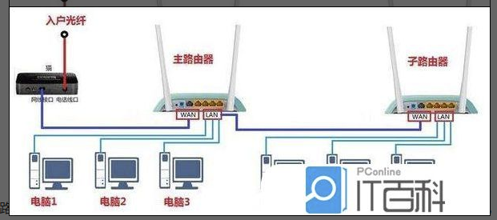
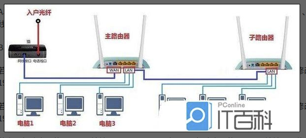
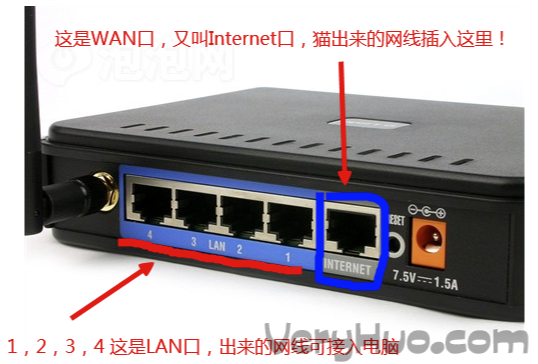

# LAN、WAN、WLAN、WiFi之间的区别

## LAN

LAN，全称Local Area Network，中文名叫做**局域网**。

顾名思义，LAN是指在某一区域内由多台计算机互联成的计算机组。一般是方圆几千米以内。局域网可以实现文件管理、应用软件共享、打印机共享、工作组内的日程安排、电子邮件和传真通信服务等功能。局域网是封闭型的，可以由办公室内的两台计算机组成，也可以由一个公司内的上千台计算机组成。

具体到路由器，我们一般组网，都是组建的LAN网络，用户在局域网里通信、传输文件。

其获取到的是内部IP，LAN 内部是交换机。我们可以不连接 WAN 口，把路由器当做普通交换机来使用。

### 路由器的两种级联方式

#### 用作二级路由

下一级路由器的WAN口连接上一级路由器的LAN口

#### 用作交换机

下一级路由器的LAN口连接上一级路由器的LAN口

## WAN

WAN，全称Wide Area Network，中文名叫做广域网。

WAN是一种跨越大的、地域性的计算机网络的集合。通常跨越省、市，甚至一个国家。广域网包括大大小小不同的子网，子网可以是局域网，也可以是小型的广域网。

WAN：接外部 IP 地址用，通常指的是出口，转发来自内部 LAN 接口的 IP 数据包。

基本每个路由器都有WAN口，当然也有路由猫这种特例。

WAN的应用场景：

1，从猫引出的来网线，要插到路由器的WAN口。

2，二级路由，上级网线插到二级路由的WAN口。

